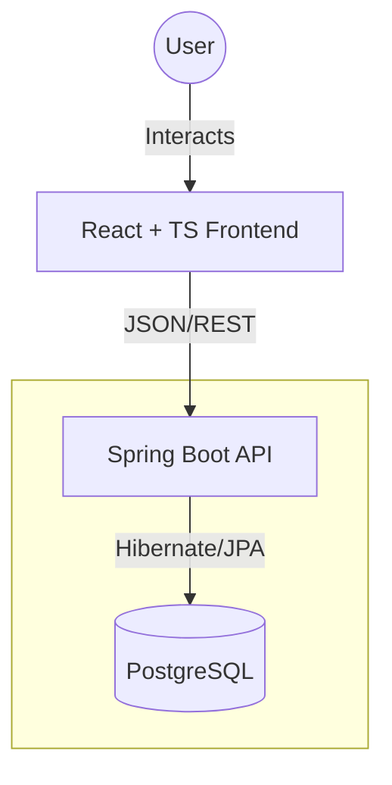

# GymTrackerApp

> **Master your progress.** A full-stack solution for tracking gym performance, managing workout routines, and visualizing strength progression over time.

### Backend
[](https://www.oracle.com/java/)
[](https://spring.io/projects/spring-boot)
[](https://flywaydb.org/)

### Frontend
[](https://react.dev/)
[](https://www.typescriptlang.org/)
[](https://vitejs.dev/)
[](https://tanstack.com/query/latest)

### Infrastructure & Tools
[](https://www.docker.com/)
[](https://www.postgresql.org/)

---

## Preview

*An intuitive, mobile-responsive dashboard built with Tailwind CSS to track your progress at a glance.*


---

## Features

### Track your progress
*Monitor your strength gains and volume metrics with interactive, real-time data visualization.*

https://github.com/user-attachments/assets/478c1962-eea9-41fd-ae1b-cec7ae0939a9
---

### Log your workouts
*Streamlined interface for logging exercises, sets, and reps. Optimized for quick entry during active rest periods.*

https://github.com/user-attachments/assets/e4c01059-1015-4083-8526-295a2ccc31d7
---

### Custom Routine Management
*Define your own workout templates and exercises. The system handles complex relational data to keep your history organized.*

https://github.com/user-attachments/assets/8653dc6b-ca25-4d02-9158-171f0386db08
https://github.com/user-attachments/assets/1ae3b014-26f9-4cdc-9d9d-7c6afc9ed976
---

### Mobile-First Experience
*Designed with mobile-first mindset, ensuring the UI is perfectly responsive for use on the gym floor.*

https://github.com/user-attachments/assets/a61a8116-5007-4946-91b9-00e77167c26b
---

## System Architecture
The **GymTrackerApp** ecosystem is built as a federated system of repositories, managed via Git Submodules for maximum modularity and independent deployment.



* **Frontend:** A Type-safe React application utilizing **Tailwind CSS** for a modern UI and **TypeScript** to ensure robust data handling.
* **Backend:** A robust **Spring Boot 3** service implementing a RESTful API, following SOLID principles and Clean Architecture.
* **Data Layer:** **PostgreSQL** handles complex relational data between users, workout templates, and historical logs.

---

### Quick Start (Local Development)
This repository acts as the **System Orchestrator**. You can spin up the entire stack locally with a single command.

#### 1. Prerequisites
* **Docker Desktop** installed and running.
* **Git** installed.

#### 2. Installation & Setup
```bash

git clone --recursive https://github.com/GymTrackerApp/GymTrackerApp.git
cd GymTrackerApp
cp .env.example .env
docker-compose up --build
```

#### 3. Access Points
| Component       | URL                                            |
|:----------------|:-----------------------------------------------|
| **Frontend UI** | [http://localhost:3000](http://localhost:3000) |
| **Backend API** | [http://localhost:8080](http://localhost:8080) |
| **Database**    | `localhost:5432`                               |

---

### Technical Key Features
* **Full CRUD Lifecycle:** Create custom workout templates, exercises and log individual training sessions with persistence. Use predefined workout templates and exercises if needed. Track your progress using historical data.
* **Type-Safe Integration:** Shared interfaces between the TypeScript frontend and Java DTOs to ensure 100% contract reliability.
* **Relational Mapping:** Advanced JPA mapping for complex relationships (Users ↔ Workouts ↔ Exercises ↔ Sets). 
* **Responsive UI:** Fully optimized for mobile devices, allowing users to log sets comfortably on the gym floor.
* **Containerized Orchestration:** Fully orchestrated via Docker Compose for a seamless "production-like" local environment.

---

### Project Ecosystem
This project is split into specialized repositories to demonstrate real-world development workflows:

* **/frontend** — The [React/TypeScript source code](https://github.com/GymTrackerApp/frontend)
* **/backend** — The [Spring Boot source code](https://github.com/GymTrackerApp/backend)
* **/GymTrackerApp** — The [Main Orchestrator Repository](https://github.com/GymTrackerApp/GymTrackerApp)

---
